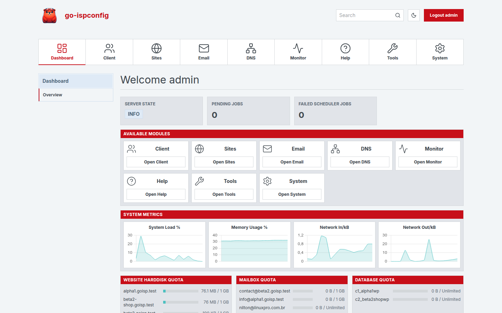
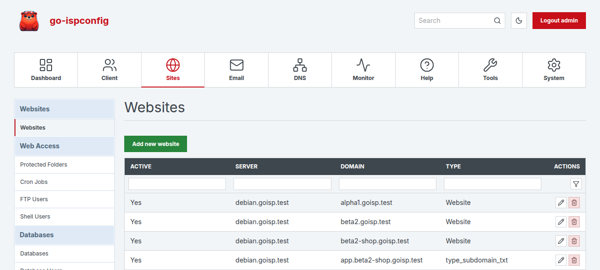
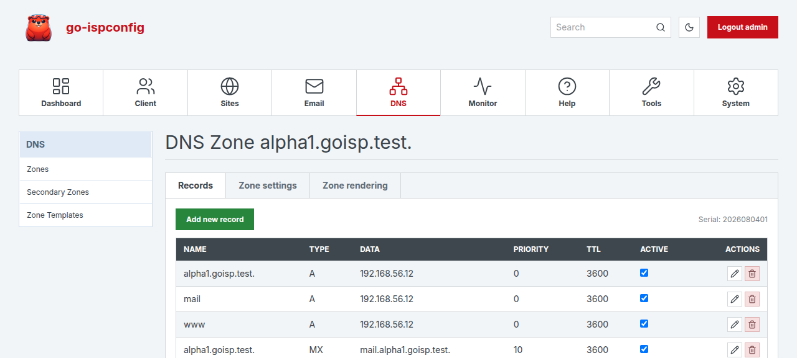
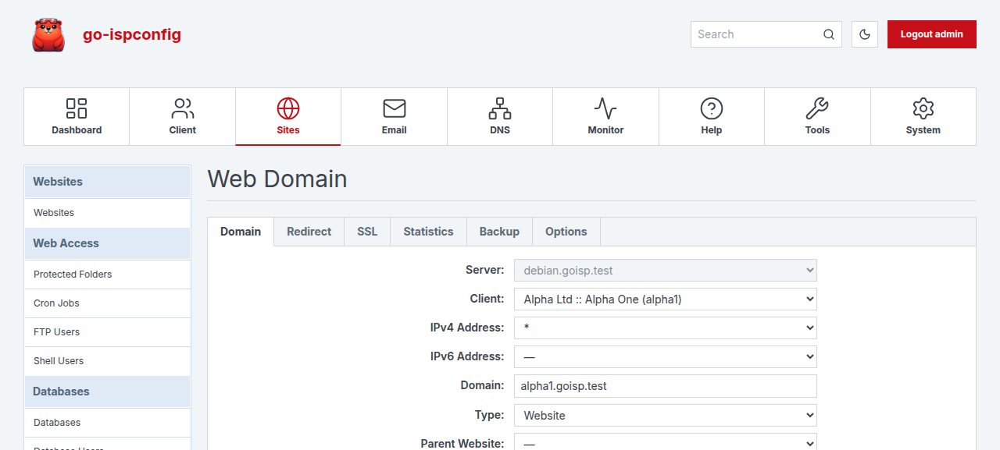
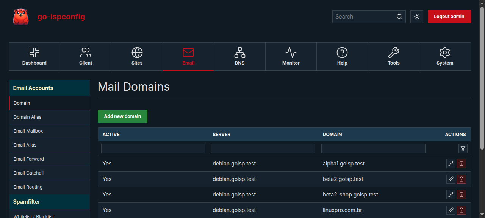

<p align="center">
  
</p>

<h1 align="center">go-ispconfig</h1>

<p align="center">
  <b>The ISPConfig3 hosting control panel, rewritten in Go as a single static binary.</b>
</p>

<p align="center">
  <a href="https://github.com/jniltinho/go-ispconfig/actions/workflows/ci.yml"></a>
  <a href="https://github.com/jniltinho/go-ispconfig/releases"></a>
  <a href="LICENSE"></a>
  
  
</p>

---

One file — no PHP, no web server in front, no crontab entries. It manages
websites, DNS, mail, databases, FTP and shell accounts, cron jobs and the
firewall on Debian and Ubuntu servers, and installs the whole stack itself.

Already running ISPConfig3? Point it at your existing `dbispconfig` database
and it adopts your data as-is — the schema is identical, table for table.



## Why switch

| | |
|---|---|
| **One binary, ~51 MB** | Panel UI, REST API, Swagger, SQL schema and config templates all embedded. Deploy = copy one file. |
| **No PHP runtime** | No PHP-FPM pool for the panel, no `php.ini` to tune, no PHP CVE to chase. Your *sites* still run whatever PHP they want. |
| **Serves its own HTTPS** | No nginx/apache reverse proxy in front. Self-signed cert on first start, or bring your own. |
| **No system crontab** | Every periodic job (SSL renewal, DNSSEC re-sign, monitoring, log rotation) runs in one supervised daemon. |
| **Built for automation** | Every screen is a client of the same REST API, and scoped API tokens make it yours too — no password in a script, no session to keep alive. |
| **Identical database** | Same 78-table ISPConfig3 schema. Adopt an existing install, or roll back to PHP if you change your mind. |
| **Same proven design** | The panel never touches the OS directly — changes flow through `sys_datalog` and a daemon applies them, exactly like ISPConfig3. |
| **Validated before apply** | vhosts are gated by `nginx -t` / `apachectl configtest`, zones by `named-checkzone`, with automatic rollback on failure. |

## A look around

| | |
|:--|:--|
| <br>**Websites** — filter row, per-column sort, inline actions | <br>**DNS** — zone wizard, 18 record types, DNSSEC |
| <br>**Tabbed forms**, field for field with the original | <br>**Mail** — and a dark scheme across every screen |

Square corners, dense tables, the same information architecture ISPConfig3
admins already know — rebuilt in Vue 3 with a dark scheme and fonts served
from the binary, so the panel makes zero external requests.

## Quick start

Debian 11–13 or Ubuntu 22.04–24.04, fresh server, as root:

```bash
VER=0.4.0
curl -fsSLO https://github.com/jniltinho/go-ispconfig/releases/download/v$VER/go-ispconfig_${VER}_amd64.deb
dpkg -i go-ispconfig_${VER}_amd64.deb
go-ispconfig install --yes --hostname srv1.example.com --admin-email you@example.com
# panel is now on https://srv1.example.com:8080/ — admin password printed once
```

The installer brings its own dependencies (nginx or apache2, MariaDB, Redis,
PHP-FPM, Bind or PowerDNS, PureFTPd, Postfix, Dovecot, Rspamd, fail2ban) and
leaves two systemd units behind. Tarball and RPM builds are on the
[releases page](https://github.com/jniltinho/go-ispconfig/releases).

## What you get

| Area | What it manages |
|---|---|
| **Websites** | vhosts on nginx or apache2, PHP-FPM pool per site, aliases and subdomains, redirects, web folder protection |
| **SSL** | Let's Encrypt via acme.sh or certbot, custom certificates, automatic daily renewal |
| **DNS** | Bind or PowerDNS, zone wizard, 18 record types, secondary zones, DNSSEC signing and re-signing |
| **Mail** | Postfix + Dovecot + Rspamd, mailboxes, aliases, forwardings, catchall, transports, relay, DKIM, per-domain spam policy, white/blacklists |
| **Databases** | Client MySQL/MariaDB databases and users, remote-access grants, phpMyAdmin link |
| **FTP / shell** | Virtual PureFTPd accounts (MySQL auth — no OS users), shell users, jailkit chroots |
| **Cron** | Per-site cron jobs, run by the panel daemon's own scheduler |
| **Security** | fail2ban jails managed from the panel with a live ban view and unban button, UFW firewall rules |
| **Clients** | Clients and resellers, per-client limits, client templates, internal messaging |
| **Monitoring** | Service state, disk and mail quotas, RAID, load/memory/network charts, log viewer |
| **System** | Per-server config editor, panel logins, API tokens, server IPs |
| **Multi-server** | Register several nodes, assign roles (web / mail / dns / db), datalog routed per server |

## Automate it

The panel has no private API — every screen calls the same endpoints you can.
Mint a scoped token in **System → Remote Users** (or from the CLI) and use it:

```bash
go-ispconfig token create deploy-bot --scope sites:write --scope dns:read
# goisp_3_iz7hpud80Yz1VrZ9gVuWsdl7QY-FLh7S6h8gmCh7mbQ   (shown once)

curl -sk https://srv1.example.com:8080/api/sites/web-domains \
  -H "Authorization: Bearer $TOKEN" | jq '.items[].domain'
```

Tokens are stored as a digest, scoped per resource, optionally IP-restricted
and expiring, revocable in one click, and they can never do more than the user
that owns them. Interactive docs ship with the binary at `/swagger/`.
Full guide: [docs/api-tokens.md](docs/api-tokens.md).

## Compatibility

| | Supported |
|---|---|
| **Distros** | Debian 11, 12, 13 · Ubuntu 22.04, 24.04 |
| **Web server** | nginx · apache2 (`--web-server`) |
| **DNS** | Bind9 · PowerDNS (`--dns-backend`) |
| **Database** | MariaDB 10.6+ / MySQL 8 |
| **Mail** | Postfix + Dovecot 2.3 and 2.4 + Rspamd |
| **Architecture** | linux/amd64 |

## Migrating from ISPConfig3 (PHP)

Two paths, both first-class:

**Same server, same database** — point the DSN at your existing `dbispconfig`.
The schema check passes, no DDL runs, nothing is seeded. Your clients, sites,
mailboxes and zones are there on first login.

**Different server** — pull everything over the legacy panel's remote API:

```bash
go-ispconfig migrate-from --url https://old-panel:8080 --user remote --dry-run
go-ispconfig migrate-from --url https://old-panel:8080 --user remote
```

`--dry-run` reports exactly what would be created before anything is written;
the password is prompted, so it stays out of your shell history.
Details and the rollback path: [docs/MIGRATION.md](docs/MIGRATION.md).

## How it works

```
  Browser ──► Panel (Go, HTTPS :8080)
                 │  writes a JSON diff row
                 ▼
            sys_datalog  ◄── source of truth, in the database
                 │  polled every 10s + instant wake via Redis
                 ▼
            Daemon (root)
                 │  render template ─► validate ─► reload service
                 ▼
   nginx · apache2 · bind · powerdns · postfix · dovecot · pure-ftpd · fail2ban
```

The panel process runs unprivileged and never touches the filesystem or a
service. If the daemon is down, changes queue in `sys_datalog` and apply when
it comes back. Full walkthrough in [docs/ARCHITECTURE.md](docs/ARCHITECTURE.md).

## Documentation

| | |
|---|---|
| [docs/README.md](docs/README.md) | **Technical deep dive** — modules, build, install, API, daemon, operations, security |
| [docs/install.md](docs/install.md) | Installer flags, every step, every file touched |
| [docs/ARCHITECTURE.md](docs/ARCHITECTURE.md) | Datalog engine, module/plugin registries, template system |
| [docs/api-tokens.md](docs/api-tokens.md) | Automating the panel: API tokens, scopes, JWT, curl examples |
| [docs/multi-server.md](docs/multi-server.md) | Running several nodes off one panel and database |
| [docs/MIGRATION.md](docs/MIGRATION.md) | Migrating from PHP ISPConfig3 |
| [docs/ROADMAP.md](docs/ROADMAP.md) | What is not built yet |
| [AGENTS.md](AGENTS.md) | Developer runbook — environment, build, test, validation |

## Contributing

Issues and pull requests are welcome. Every module is specified before it is
written: proposals live in [`openspec/changes/`](openspec/changes/) and the
consolidated capabilities in [`openspec/specs/`](openspec/specs/). Read
[AGENTS.md](AGENTS.md) first — it has the build and test commands, and the
validation each change is expected to pass.

```bash
make all      # build frontend + binary
make test     # go test ./internal/...
make lint     # golangci-lint
```

## License

MIT — see [LICENSE](LICENSE).

go-ispconfig is an independent reimplementation and is not affiliated with or
endorsed by the ISPConfig project.
