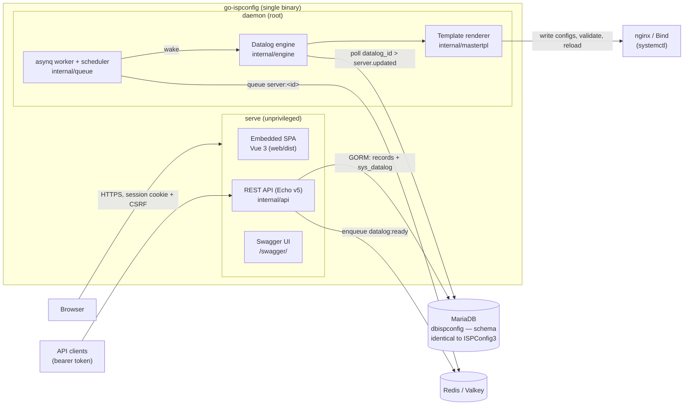
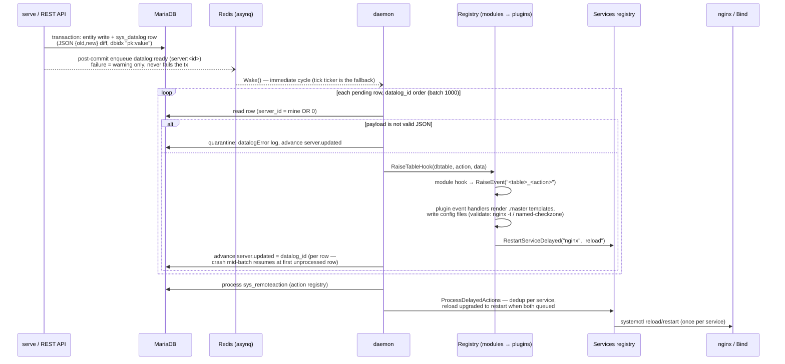

# go-ispconfig Architecture

go-ispconfig collapses the three PHP layers of ISPConfig3 (`interface/`,
`server/`, `install/`) into one Go binary while keeping the same database
schema and the same event architecture. The layers stay decoupled **only
through the database**, exactly like the original: the panel/API never touches
the OS; the daemon is the only writer of system configuration.

Design decisions referenced below (D1, D2, ...) are documented in
[`openspec/changes/port-ispconfig3-to-go/design.md`](../openspec/changes/port-ispconfig3-to-go/design.md).

## Component overview

One binary, two long-running modes (D1): `serve` runs unprivileged and only
writes to the database; `daemon` runs as root and applies configuration.



Key properties:

- **sys_datalog is the source of truth** for configuration changes; Redis
  transports *work, never state* (D12). If Redis is down, datalog writes still
  succeed and the daemon's poll ticker picks them up.
- The daemon refuses to start on multi-server or mirror databases
  (`GuardServer`, D2) and takes a single-instance `flock`.
- Static process config lives in `config.toml` (Viper, env prefix `GOISP_`);
  runtime server behavior stays in the DB (`server.config` INI, `sys_config`,
  `sys_ini`) parsed by `internal/getconf` (D8) — so a server's daemon is
  reconfigurable from the panel.

## sys_datalog flow

Port of `server.php` / `modules.inc.php` / `plugins.inc.php`. The API writes
JSON `{old,new}` diffs (changed fields only on update) instead of PHP
`serialize`; everything else keeps ISPConfig semantics.



Registries (`internal/engine/registry.go`, D3) are typed Go interfaces wired
in code, not filesystem scans: a `Module` registers table hooks and announces
the events it may raise; a `Plugin` subscribes to announced events
(registration against an unannounced event is a startup error). Handlers must
be **idempotent** — per-row `server.updated` advancement means a crash between
hook execution and the advance reprocesses that row.

Scheduled jobs (traffic accounting, datalog pruning, ...) are asynq periodic
tasks executed by the worker embedded in the daemon (D1b/D12), with
last-run/status mirrored to `sys_config` for the panel. No system cron.

## riud permission model

Every ported table carries `sys_userid`, `sys_groupid`, `sys_perm_user`,
`sys_perm_group`, `sys_perm_other` — permission strings like `riud`
(**r**ead, **i**nsert, **u**pdate, **d**elete). A single GORM scope,
`repository.WithPerm(identity, flag)` (port of `tform_base::getAuthSQL`), is
the **only** query path: every repository read/update/delete goes through it,
so a handler can never bypass isolation.

```mermaid
flowchart TD
    Q["Query via Repo[T] with flag f ∈ {r,i,u,d}"] --> A{identity.IsAdmin?<br/>(typ = admin)}
    A -- yes --> ALL[No restriction — full access]
    A -- no --> W["WHERE appended (any match grants access):"]
    W --> U["sys_userid = my userid<br/>AND sys_perm_user LIKE '%f%'"]
    W --> G["sys_groupid IN (my groups)<br/>AND sys_perm_group LIKE '%f%'"]
    W --> O["sys_perm_other LIKE '%f%'"]
    U & G & O --> RES["Row visible / writable"]
```

Access levels and the reseller graph:

- **admin** — bypasses the scope entirely (ISPConfig `sys_user` id 1 semantics
  preserved; superadmin checks in policy middleware).
- **reseller** — `Identity.Groups` is resolved from `sys_user.groups` (CSV
  multi-group list) plus the groups of clients whose
  `client.parent_client_id` points at the reseller, so a reseller sees its
  clients' records through the group clause.
- **client** — its own user/group only. Cross-client and cross-reseller
  isolation is enforced by the same clause and covered by a dedicated
  integration test suite (`internal/repository/perm_integration_test.go`).

Writes stamp ownership (`sys_userid`/`sys_groupid` from the identity's default
group) and per-record permission presets on insert; update/delete first verify
the flag via the scope and return not-found on denial (no information leak).

Sessions are server-side rows in `sys_session`; browsers authenticate with an
HTTP-only `SameSite=Strict` cookie plus a per-session CSRF token on every
mutating endpoint, and non-browser clients present the same session id as a
bearer token (D4). Brute-force lockout counts failures per hashed IP in
`attempts_login`.

## Migration cutover (PHP ISPConfig3 → go-ispconfig)

Shared-database cutover, Path A of [`MIGRATION.md`](MIGRATION.md) (D9, D10).
No coexistence: PHP cannot read the JSON datalog rows go-ispconfig writes.

```mermaid
sequenceDiagram
    actor Op as Operator
    participant PHP as PHP ISPConfig3<br/>(panel + cron daemon)
    participant DB as MariaDB (dbispconfig)
    participant GO as go-ispconfig

    Note over PHP,DB: 1. Drain the queue
    PHP->>DB: process pending sys_datalog until<br/>server.updated = MAX(datalog_id)
    Op->>PHP: 2. stop panel vhost, disable server.sh /<br/>cron_daily.sh cron entries

    Note over GO,DB: 3. Adopt the database
    Op->>GO: config.toml DSN → existing dbispconfig
    GO->>DB: migrate — detects schema via server.dbversion:<br/>no DDL, no seed, validates >= 3.3.x<br/>(older: abort, update PHP first)

    Note over GO,DB: 4. Go live
    Op->>GO: start serve + daemon (systemd)
    GO->>DB: users log in with existing credentials<br/>(crypt $6$/$1$ verified; bcrypt rehash opt-in)
    GO->>DB: new sys_datalog rows are JSON
    GO->>GO: one-shot resync: re-render active vhosts/zones

    Note over Op,GO: Rollback (schema untouched either way)
    Op->>GO: stop go-ispconfig, drain its JSON rows
    Op->>PHP: verify auth.rehash_legacy was never enabled,<br/>re-enable PHP crons
```

The rollback path is why legacy password rehash is **opt-in and off by
default** (D10): PHP ISPConfig cannot verify bcrypt, so an eager rewrite would
strand users on rollback.

## Package map

| Package | Role |
|---|---|
| `cmd/` | Cobra commands: `install`, `uninstall`, `serve`, `daemon`, `migrate`, `migrate-from`, `templates`, `init`, `version` |
| `internal/api` | Echo v5 bootstrap, auth endpoints, generic CRUD framework, form metadata, Swagger |
| `internal/auth` | Password verify (bcrypt + legacy crypt), sessions, security policy flags |
| `internal/repository` | `WithPerm` scope, generic `Repo[T]`, identity resolution, login lockout |
| `internal/datalog` | Transactional datalog writer (JSON diffs) + post-commit `datalog:ready` notifier |
| `internal/engine` | Daemon loop, module/plugin/action registries, services (delayed restarts), job scheduler |
| `internal/queue` | asynq client/server wrappers, per-server queues, periodic tasks |
| `internal/mastertpl` | ISPConfig `.master` template lexer/renderer |
| `internal/database` | Embedded `ispconfig3.sql`, migrate/adopt logic, seed |
| `internal/model` | GORM models with explicit column tags (subset of the ~80 tables) |
| `internal/getconf` | `server.config` INI + `sys_config`/`sys_ini` accessors |
| `internal/validator` | tform validator port (REGEX, UNIQUE, ISEMAIL, ...) |
| `internal/config` | `config.toml` loading (Viper, `GOISP_` env prefix) |
| `internal/installer` | `install`/`uninstall` step pipeline: distro profiles, packages, MariaDB, base configs, systemd units |
| `internal/legacy` | Remote-API client and import engine for a running PHP ISPConfig3 |
| `frontend/` | Vue 3 + Vite + Tailwind v4 SPA, built into `web/dist` and embedded |

Module packages register a datalog module (table hooks) and/or the plugins
that apply the resulting events (one doc each, linked from the
[README](../README.md)):

| Package | Module hooks / plugins |
|---|---|
| `internal/web`, `internal/nginx` | `web_domain`, `web_folder*`, `ftp_user`, `shell_user` hooks → nginx vhosts, PHP-FPM pools, SSL |
| `internal/dns`, `internal/powerdns` | `dns_soa`/`dns_slave`/`dns_rr` hooks → Bind zonefiles or PowerDNS gmysql rows (mutually exclusive, chosen by `server.config` `dns_backend`) |
| `internal/mail` | mail/spamfilter hooks → Postfix maps, Dovecot, DKIM keys, Rspamd settings |
| `internal/clientdb` | `database`/`database_user` hooks → MySQL databases, users and grants |
| `internal/ftp`, `internal/shell`, `internal/jailkit` | FTP login dirs (virtual accounts), shell users, jailkit chroots |
| `internal/cron` | `cron` hooks → jobs run by the daemon scheduler, never a system crontab |
| `internal/firewall` | `firewall` hooks → UFW rule sets |
| `internal/clients` | `client` hooks (broadcast) + limit/usage computation |
| `internal/monitor` | scheduler-only: state, log and quota collectors writing `monitor_data` |
