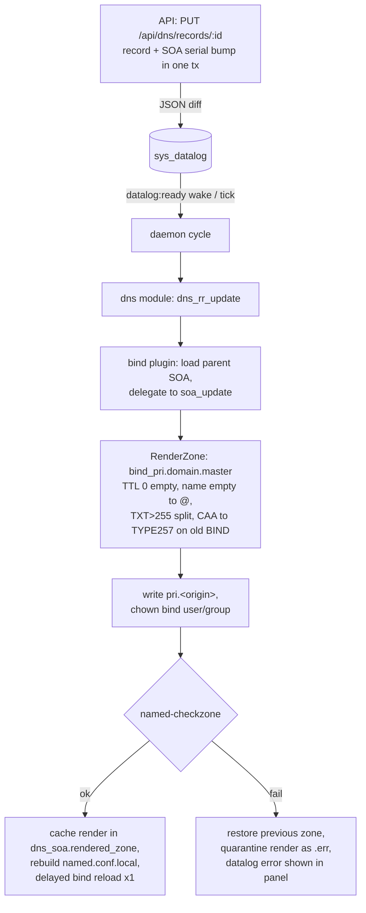

# DNS module (Bind)

Go port of ISPConfig3's `dns_module.inc.php` and `bind_plugin.inc.php`
(OpenSpec change `add-dns-bind-module`). A change to a `dns_soa`, `dns_rr`
or `dns_slave` row ends as a live, `named-checkzone`-validated zone file
plus a rebuilt `named.conf.local` — or a clean rollback with the error
surfaced in the panel.

Packages: `internal/dns` (module + bind plugin + bind service),
`internal/api` + `frontend/` (DNS REST API and UI). The daemon loads the
dns module and bind plugin only on DNS servers (`server.dns_server = 1`,
`cmd/daemon.go`) and only when the server's `[dns] dns_backend` is `bind`
(the default). PowerDNS is now a supported alternative applying backend
— same events, same panel/API, different daemon plugin — see
[powerdns-module.md](powerdns-module.md).

## Event flow

The **dns module** hooks the datalog tables `dns_soa`, `dns_slave` and
`dns_rr` and raises the nine ISPConfig-named events
(`dns_soa_insert/update/delete`, `dns_slave_*`, `dns_rr_*`). It also
registers the `bind` service, resolved to the `bind9` systemd unit with a
`named` fallback (RedHat-style hosts); reloads/restarts are always delayed
and deduplicated per daemon batch.

The **bind plugin** subscribes to all nine events. Record events load their
parent SOA (`new.zone`/`old.zone`) and delegate to the zone pipeline — a
record change always regenerates the whole zone; missing or inactive
parents are no-ops. Slave events rebuild `named.conf.local` and create the
slave zonefile directory (0770, bind-owned) so named can write transferred
zones.

## Zone pipeline

`dns_soa_update` (and every path that delegates to it) runs: render →
write → validate → `named.conf.local` → cleanup → delayed reload.

The zone file path is derived from the origin (trailing dot stripped,
`/` → `_`, master prefix `pri.` by default). Zones without records are
skipped (PHP parity). `named.conf.local` is always rebuilt from the
database as a whole: primary zones (active, this server, zone file on
disk, `.signed` file when `dnssec_wanted`, xfer/also-notify/update-acl
options) plus secondary zones (masters from `ns`, `allow-transfer
{none;}` default), written atomically. An origin rename or zone delete
removes the old zone file and its `.err`/`.signed`/key material.
`update_acl` changes escalate the delayed reload to a restart.

## DNSSEC

Enabling DNSSEC on a zone (`dnssec_wanted = Y`) runs the ported
`soa_dnssec_*` lifecycle: `dnssec-keygen` creates ZSK+KSK pairs
(ECDSAP256SHA256 = alg 13, NSEC3RSASHA1 = alg 7, glob guards against
overwriting existing keys), the zone gets `$INCLUDE`-signed via
`dnssec-signzone -A -e +1382400 -3 - -N increment` (gated by
`named-checkzone`), and the DS/DNSKEY records are published into
`dns_soa.dnssec_info` for the panel, with `dnssec_initialized` and
`dnssec_last_signed` bookkeeping. Origin changes re-key, algorithm changes
re-sign, disabling removes the `.signed` file (keys stay until zone
delete), zone deletion removes keys and dsset files.

A daily scheduler job (`dns_resign`) re-signs zones whose signature is
older than 5 days (`[dns] dnssec_resign_days` overrides) and queues one
bind reload when anything changed. No system cron.

## Zone wizard and templates

`dns_template` rows keep the ISPConfig text format: a `[ZONE]`
`key=value` section plus `[DNS_RECORDS]` lines (`TYPE|name|data|aux|ttl`)
with the `{DOMAIN}/{IP}/{IPV6}/{NS1}/{NS2}/{EMAIL}` placeholders —
templates from a migrated ISPConfig3 database expand unchanged. The
wizard (`POST /api/dns/zones/wizard`) expands the template, injects
DNSSEC when the template asks for it, sets the initial serial to
`<today>01` and creates zone + records in a single transaction. Admins
manage templates in the panel (DNS → Templates).

## Records API and validation

Typed record CRUD covers the 18 Bind types (A, AAAA, ALIAS, CAA, CNAME,
DNAME, DS, HINFO, LOC, MX, NAPTR, NS, PTR, RP, SRV, SSHFP, TLSA, TXT)
plus the TXT-derived SPF/DKIM/DMARC helpers. Validation is driven by
per-type declarative metadata (port of the `dns_<type>.tform.php` rules:
name/data/aux/ttl validators, TXT negative regexes) exported as JSON for
the UI, so the record dialog renders its fields and errors from the same
source. Every record mutation bumps the SOA serial (`YYYYMMDDnn`,
`SELECT ... FOR UPDATE`) in the same transaction unless
`update_serial=false`. Zone-level validation enforces FQDN origins
(IDN-normalized, unique), ns/mbox syntax, minimum timer ranges and
admin-only `update_acl`.

## Config keys

The plugin reads the `[dns]` section of `server.config` (getconf), same
keys as ISPConfig: `bind_user`, `bind_group`, `bind_zonefiles_dir`,
`bind_keyfiles_dir`, `bind_zonefiles_masterprefix`,
`bind_zonefiles_slaveprefix`, `named_conf_local_path`,
`disable_bind_log`, plus the Go-only `dnssec_resign_days`. Empty keys
fall back to the Debian defaults (`/etc/bind`, prefix `pri.`,
`/etc/bind/named.conf.local`). The zone template
`bind_pri.domain.master` is embedded and overridable via
`go-ispconfig templates export` (conf-custom parity).

## Migration notes

After cutover from a PHP ISPConfig3 install, the DNS data is fully
managed and self-healing: zone files and `named.conf.local` are always
regenerated from the database, so the first change to any zone rewrites
its file from the migrated rows — no import of the old `/etc/bind` state
is needed. The last validated render is cached in
`dns_soa.rendered_zone` and shown in the panel's Zone rendering tab.

## Manual validation on a VM

The full Vagrant rig (Ubuntu 24.04 box, provisioning, real BIND tools)
belongs to the `add-installer-cli` change; the module-level validation
below — including DNSSEC with real `dnssec-keygen`/`dnssec-signzone` — is
**documented here and executed there** once the installer can provision
the VM. Do not build an ad-hoc VM for this module.

Procedure (Ubuntu 24.04, root):

1. **Install dependencies**: `apt install bind9 bind9utils dnsutils
   mariadb-server redis-server` (or point `config.toml` at external
   MariaDB/Redis).
2. **Initialize**: copy the `go-ispconfig` binary, run `go-ispconfig init`,
   set the DB DSN and `[queue]` address in `config.toml`, then
   `go-ispconfig migrate`; set `dns_server = 1` on the server row.
3. **Run**: `go-ispconfig serve` (panel/API) and `go-ispconfig daemon`
   (as root — it writes zone files and reloads bind).
4. **Create a zone via the wizard**: DNS → Add zone (Default template).
   Expect `/etc/bind/pri.<domain>` and the zone in
   `/etc/bind/named.conf.local` after the daemon cycle.
5. **Resolve**: `dig @127.0.0.1 <domain> SOA +norec` and an A record from
   the wizard — expect authoritative answers and the `<today>01` serial.
6. **Record edit**: change an A record in the panel; expect the zone file
   rewritten with the bumped serial and `rndc reload` applied.
7. **DNSSEC**: enable DNSSEC on the zone; expect
   `K<domain>.+013+*.{key,private}` under `/etc/bind`,
   `pri.<domain>.signed`, the DS/DNSKEY block in the panel and
   `dig @127.0.0.1 <domain> DNSKEY +dnssec` returning RRSIGs.
8. **Re-sign job**: backdate `dns_soa.dnssec_last_signed` by 6 days and
   run the `dns_resign` job; expect a fresh signature and one reload.
9. **Secondary zone**: add a secondary zone pointing at an external
   master; expect the slave entry in `named.conf.local` and the
   transferred file under the slave dir.
10. **Rollback**: force broken record data into the DB (bypassing the
    API), trigger an update and confirm the previous zone file is
    restored, the broken render is quarantined as `.err` and the datalog
    row shows the `named-checkzone` output.

The end-to-end behavior of steps 4–10 is already pinned by the automated
integration suite (`internal/dns/dns_integration_test.go`, run with
`go test -tags=integration ./internal/dns/`) against docker MariaDB/Redis
with faked BIND tools; the VM pass validates the real binaries.
