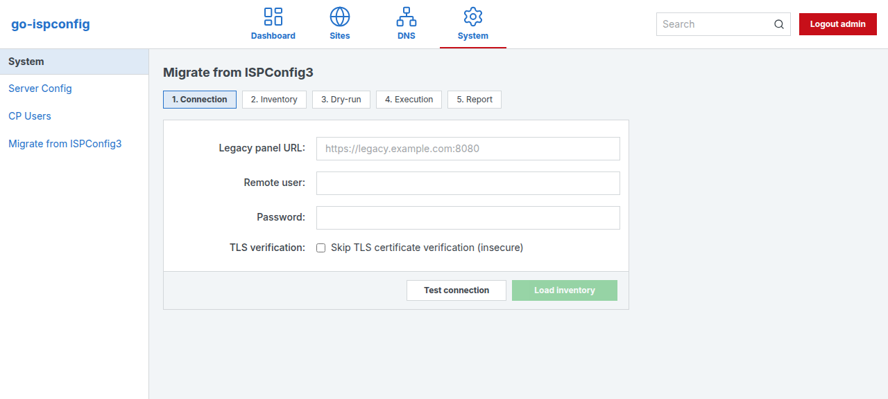
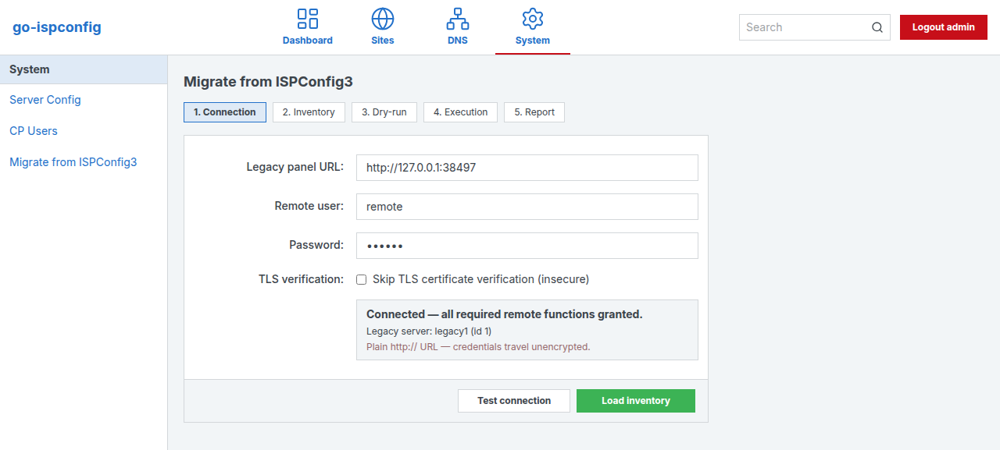
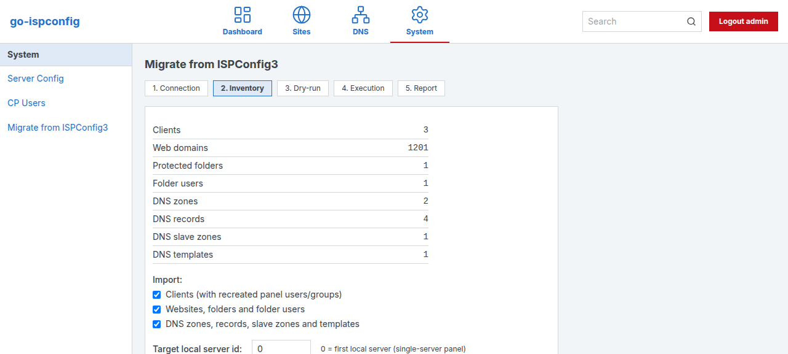
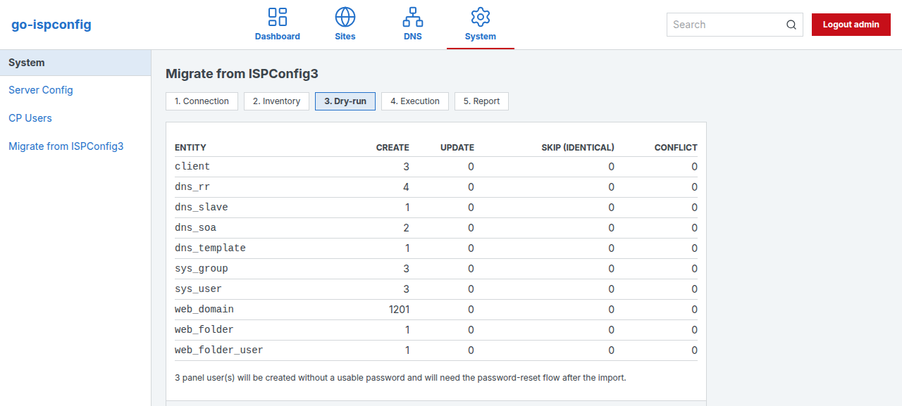
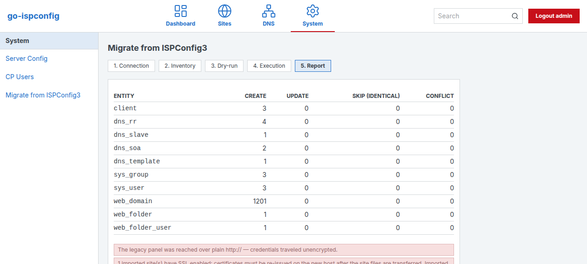

# Remote migration from a legacy ISPConfig3 panel

Imports clients, web domains/folders and DNS zones/records from a **remote**
PHP ISPConfig 3.1+ panel over its remote JSON API. The legacy panel is only
ever **read** — the import cannot modify or damage the source system. Two
frontends share the same engine: the panel wizard (System → Migrate from
ISPConfig3) and the `migrate-from` CLI command.

For the same-host / same-database cutover path, see [MIGRATION.md](MIGRATION.md).
This document covers the remote path (legacy panel on another host/database).

What is imported: clients (with recreated panel users/groups), `web_domain`
(vhost/vhostsubdomain/vhostalias incl. SSL fields), `web_folder` +
`web_folder_user`, `dns_soa` + `dns_rr`, `dns_slave`, `dns_template`.
Out of scope: mail/ftp/shell/cron/database entities, site **files** (see
[File transfer](#site-file-transfer-operator-responsibility)), continuous
sync, panels older than 3.1.

## 1. Prepare the legacy panel (one-time)

On the **legacy** ISPConfig panel, as admin:

1. **Enable the Remote API** — System → Main Config → Security: set
   *Remote API allowed* to `yes` (the import speaks to
   `<panel URL>/remote/json.php`).
2. **Create a remote user** — System → Remote Users → Add new user. Grant the
   **read** function groups; the import needs exactly these functions:

   - `client_get`, `client_get_all`
   - `sites_web_domain_get`, `sites_web_folder_get`, `sites_web_folder_user_get`
   - `dns_zone_get` (also covers records and slave zones), `dns_rr_get_all_by_zone`, `dns_slave_get`
   - `dns_templatezone_get_all`
   - `server_get`, `server_get_all`
   - `get_function_list` (used by the connection test itself)

   No `*_add`/`*_update`/`*_delete` grant is required — the client never
   calls a mutating function. The connection test verifies every grant
   upfront and names the exact missing functions before anything is fetched.
3. If the remote user restricts source IPs, add the new panel host's IP.
4. **Update the legacy panel to the latest ISPConfig 3.3.x first** if it is
   older. Adopting the legacy database directly (Path A in
   `docs/MIGRATION.md`) requires `server.dbversion >= 104` (3.3.1);
   `go-ispconfig migrate` refuses older databases with an actionable
   error naming the required version — run the PHP `ispconfig_update.sh`
   to close the gap (validated against a real 3.3.0p1 install at
   dbversion 101). The remote-API import described here talks to the
   API, not the DB, and works on any 3.x with the grants above.

> **TLS note**: many legacy panels run a self-signed certificate without
> a SAN extension. Go rejects those with
> `x509: certificate is not valid for any names` — that error means the
> cert has no SAN, not that the host is unreachable. Fix the cert on the
> legacy panel or use *skip TLS verification* / `--insecure` (loudly
> warned and repeated in the final report).

## 2. Wizard walkthrough (System → Migrate from ISPConfig3)

Admin-only. Five steps; the legacy credentials are held only in the panel
process memory for the wizard session — never stored in the database, config
files, logs or responses.

1. **Connection** — legacy panel URL, remote user, password.
    *Skip TLS
   verification* is available for self-signed panels but is loudly warned
   about and echoed in the final report; plain `http://` URLs work but are
   flagged (credentials travel unencrypted). *Test connection* logs in, runs
   the grant preflight and shows the legacy server list — or the legacy
   fault code / the exact missing remote functions.
   
2. **Inventory** — per-entity counts read from the legacy panel, the
   clients/sites/dns import toggles, and the target local server id
   (0 = the first local server; this panel is single-server).
   **Multi-server guard:** when the legacy panel reports more than one
   server the wizard blocks here and requires an explicit confirmation
   checkbox to map *everything* onto the single local server — multi-server
   topologies are not supported.
   
3. **Dry-run** — builds the real plan (create / update / skip-identical /
   conflict per record) without writing anything. Conflicts are listed with
   record, natural key and reason (already-existing record owned by another
   user, missing owner/parent/zone, …). Conflicts are *skipped* by the
   import; resolve them and re-run — the import is idempotent, re-running
   never duplicates records.
   
4. **Execution** — the import runs server-side in the background; progress
   streams per entity (SSE, with automatic polling fallback behind buffering
   proxies). Reloading the page is safe: the wizard reattaches to the
   running or finished import via the status endpoint. One import runs at a
   time.
5. **Report** — per-entity counts, warnings (insecure TLS, SSL re-issue,
   multi-server mapping), the **password-reset list** with the bulk
   one-time-token action, the operational order and per-site rsync
   suggestions.
   

## 3. CLI walkthrough (`migrate-from`)

```bash
# Always dry-run first: prints inventory, the full plan and every conflict.
go-ispconfig migrate-from --url https://legacy.example.com:8080 \
    --user migrator --dry-run
# (password prompted without echo; --password works for scripts)

# Apply. Exit code is non-zero on login/preflight failure, on a dry-run
# with conflicts, and on any entity failure.
go-ispconfig migrate-from --url https://legacy.example.com:8080 --user migrator

# Useful flags
#   --only clients,sites,dns        entity subset (dependency-ordered)
#   --insecure                      skip TLS verification (echoed in report)
#   --map-all-to-local-server       explicit multi-server confirmation
#   --assign-orphan-zones-to-admin  zones with absent owners go to admin
#   --reset-passwords               print one-time reset tokens after apply
```

The command runs on the **new** host and reads its `config.toml` for the
local database. The plan/report output is the same as the wizard's.

## 4. Passwords

- **Service passwords** (web folder users, client field) arrive as crypt
  hashes (`$1$/$5$/$6$`) and are imported **verbatim** — they keep working.
- **Panel logins can never be imported**: the remote API does not expose
  `sys_user` password hashes. Every recreated panel user is created with an
  unusable placeholder and **cannot log in** until reset.
- **Bulk reset:** the wizard report's *Generate one-time reset tokens*
  button (or `--reset-passwords` on the CLI) creates one token per flagged
  user in bulk. Tokens are shown **once**; only a digest is stored. No
  plaintext password is ever generated, stored or logged.
  

## 5. Site file transfer (operator responsibility)

The import creates the vhosts but does **not** copy site files. The report
prints one suggestion per site:

```bash
rsync -a --usermap=*:web1 --groupmap=*:client4 \
    legacy.example.com:/var/www/clients/client4/web1/ /var/www/clients/client4/web1/
# or, after a plain rsync:  chown -R web1:client4 /var/www/clients/client4/web1
```

The uid/gid remap matters: `web<N>`/`client<N>` names match on both hosts,
but their **numeric** uid/gid differ on the new host, so either let rsync
map by name (`--usermap`/`--groupmap`) or `chown -R` afterwards.

## 6. Operational order (do not reorder)

1. **Wait for the daemon** to drain `sys_datalog` — the import journals
   every record and the daemon materializes nginx vhosts and Bind zones in
   LIMIT-1000 batches.
2. **Transfer the site files** (previous section).
3. **Only then enable SSL / Let's Encrypt.** Legacy certificates are not
   reused; the SSL fields are imported but certificates must be re-issued
   on the new host, and the ACME webroot challenge **fails on an empty
   docroot** — files first. Note: imported certificate/key material also
   passed through `sys_datalog`; treat it as exposed and rotate.
4. **DNS cutover:** lower TTLs on the legacy side, switch the zones'
   IPs/NS to the new host, wait out the old TTLs, then decommission the
   legacy panel.

## 7. Idempotency, conflicts and rollback

- Records match by natural key (client username, domain+type, zone origin,
  …). Re-running the import updates changed records, skips identical ones
  and never duplicates.
- Conflicting records (e.g. `example.com` already exists locally owned by a
  different user) are never touched; fix the local side or the selection
  and re-run.
- **Rollback:** imported records are ordinary panel records — delete them
  through the panel (deletions are journaled like any change). The legacy
  system was never written to and stays authoritative until DNS cutover.

## 8. SOAP fallback

The import uses only the JSON handler (`/remote/json.php`), present on
every supported 3.1+ install. If an installation has the JSON handler
disabled, enable it (it ships with the stock remote API) — a SOAP client is
deliberately not implemented; the JSON surface is identical.
