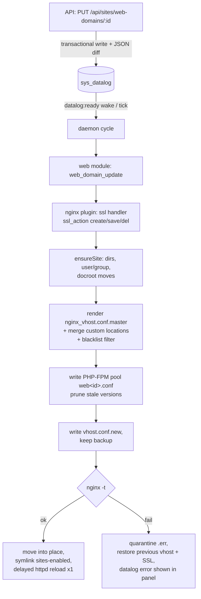

# Web module (nginx)

Go port of ISPConfig3's `web_module.inc.php`, `nginx_plugin.inc.php` and
`letsencrypt.inc.php` (OpenSpec change `add-web-nginx-module`). A change to a
`web_domain` row ends as a live, `nginx -t`-validated vhost with a PHP-FPM
pool, provisioned site directories and system user — or a clean rollback with
the error surfaced in the panel.

Packages: `internal/web` (module + services), `internal/nginx` (plugin),
`internal/api` + `frontend/` (Sites REST API and UI). The daemon always loads
the web module and nginx plugin (`cmd/daemon.go`).

## Event flow

The **web module** hooks the datalog tables `web_domain`, `web_folder` and
`web_folder_user` and raises the ISPConfig-named events
(`web_domain_insert/update/delete`, …). Unported tables (`ftp_user`,
`webdav_user`, `aps_*`, …) are simply not hooked; adding them later is
additive. The module also registers the services:

- `httpd` — maps to the nginx systemd unit; every restart/reload is guarded
  by `nginx -t` (a broken config can never take nginx down);
- one `php-fpm` service per FPM unit (server default + each active
  `server_php` row), deduplicated per unit by the delayed-restart registry.

The **nginx plugin** registers two handlers per `web_domain` event, in
order: `ssl` first (certificates must exist on disk before the vhost that
references them is rendered), then the insert/update/delete handler. It also
subscribes to `web_folder*` events (HTTP basic auth) and to `client_delete`
(cascade teardown, raised by the future client module).

## Vhost pipeline

`web_domain_update` (and insert) runs: provision → render → merge →
blacklist → write with backup → `nginx -t` → activate → delayed reload.



Alias/subdomain records (`type != vhost`) re-render their parent vhost.
Deletion tears down vhost, symlinks, pool, site tree and system user, behind
sanity guards (never outside `website_basedir`, never short paths).

## PHP-FPM pools

One pool per site, named `web<domain_id>`, rendered from
`php_fpm_pool.conf.master` into the pool dir of the PHP version resolved
from `server_php` (falling back to the `[web]` server defaults). Covers pm
modes (dynamic/static/ondemand), unix socket vs TCP (stable port =
`php_fpm_start_port + domain_id - 1`), open_basedir and custom php.ini
lines. On version/socket changes the old pool file is removed and both FPM
versions get one delayed reload each.

## SSL and Let's Encrypt

- `ssl_action=create` generates an openssl key/CSR/self-signed cert into the
  site's `ssl/` dir (0400 key) and writes the fields back without a datalog
  echo; `save` persists pasted cert/key (rejecting `.acme.invalid`); `del`
  removes files and clears the DB fields.
- `ssl_letsencrypt=y` issues via an **existing** acme.sh (preferred) or
  certbot — the plugin never installs a client (that is the installer's
  job). Failures never break the site: it falls back to the previous cert or
  non-SSL with a datalog error.
- A daily scheduler job (`letsencrypt_renew`, 02:00) runs the client's
  renew command and
  reloads nginx only when certificates actually changed. No system cron.

## nginx_directives blacklist

Custom `nginx_directives` are validated twice against the embedded
`security/nginx_directives.blacklist` (same PCRE list as ISPConfig): the
Sites API rejects offending directives with a per-field 422, and the
render-time filter strips them (recording a datalog error) as defense in
depth for rows that bypassed the API, e.g. migrated data.

## Custom templates

`nginx_vhost.conf.master` and `php_fpm_pool.conf.master` are embedded. To
customize (conf-custom parity), export the originals and edit — a file with
the same name in `[templates] custom_dir` (default
`/etc/go-ispconfig/templates-custom`) overrides the embedded one:

```bash
go-ispconfig templates list
go-ispconfig templates export nginx_vhost.conf.master
```

## Config keys

The plugin reads the `[web]` section of `server.config` (getconf), same keys
as ISPConfig: `website_basedir`, `website_path`, `website_symlinks`,
`nginx_vhost_conf_dir`, `nginx_vhost_conf_enabled_dir`, `nginx_user/group`,
`php_fpm_init_script`, `php_fpm_pool_dir`, `php_fpm_socket_dir`,
`php_fpm_start_port`, `security_level`, `skip_le_check`,
`le_signature_type`, … Debian/Ubuntu defaults ship in the seed
(`internal/database/server_config.ini`).

## Phase 2 (fields stored, jobs later)

Quota enforcement, traffic accounting and statistics engines: the
`web_domain` fields exist and are exposed in API/UI, but no daemon job acts
on them yet. Jailkit fields are persisted only — jail logic belongs to
`add-ftp-shell-module`. Apache, webdav, pagespeed and APS are out of scope
(see the change's design non-goals).

## Manual validation on a VM

The full Vagrant rig (Ubuntu 24.04 box, provisioning, real nginx/php-fpm)
belongs to the `add-installer-cli` change; the module-level validation below
is **documented here and executed there** once the installer can provision
the VM. Do not build an ad-hoc VM for this module.

Procedure (Ubuntu 24.04, root):

1. **Install dependencies**: `apt install nginx php8.3-fpm mariadb-server redis-server`
   (or point `config.toml` at external MariaDB/Redis). Optional for Let's
   Encrypt: acme.sh or certbot.
2. **Initialize**: copy the `go-ispconfig` binary, run `go-ispconfig init`,
   set the DB DSN and `[queue]` address in `config.toml`, then
   `go-ispconfig migrate` (note the printed admin password).
3. **Run**: `go-ispconfig serve` (panel/API) and `go-ispconfig daemon`
   (as root — it writes vhosts and runs useradd/nginx/php-fpm).
4. **Create a site via the panel**: Sites → Add website (type vhost,
   PHP-FPM). Watch the pending indicator clear after the daemon cycle.
5. **Verify on disk**: vhost in `/etc/nginx/sites-available/<domain>.vhost`,
   symlink in `sites-enabled/`, pool in `/etc/php/8.3/fpm/pool.d/web<id>.conf`,
   site tree under `/var/www/clients/client<cid>/web<id>/`.
6. **Serve a PHP page**: drop `<?php phpinfo();` into the site's `web/` dir
   and `curl -H "Host: <domain>" http://127.0.0.1/` — expect the page via
   the domain's php-fpm socket.
7. **Self-signed SSL**: SSL tab → create certificate; expect
   `ssl/<domain>.{key,csr,crt}` in the site dir and an https listen in the
   vhost; `curl -k https://<domain>/`.
8. **Custom directive merge**: add a custom `location` block in the Options
   tab and confirm it replaces/extends the template block in the rendered
   vhost.
9. **Blacklist rejection**: try `load_module ...;` as a custom directive —
   the API must reject it with a per-field validation error.
10. **Rollback**: force a broken directive into the DB (bypassing the API),
    trigger an update and confirm the previous vhost is restored, the broken
    render is quarantined as `.err` and the datalog row shows the
    `nginx -t` output.

The end-to-end behavior of steps 4–10 is already pinned by the automated
integration suite (`internal/nginx/nginx_integration_test.go`, run with
`go test -tags=integration ./internal/nginx/`) against docker MariaDB/Redis
with a faked OS seam; the VM pass validates the real nginx/php-fpm binaries.
